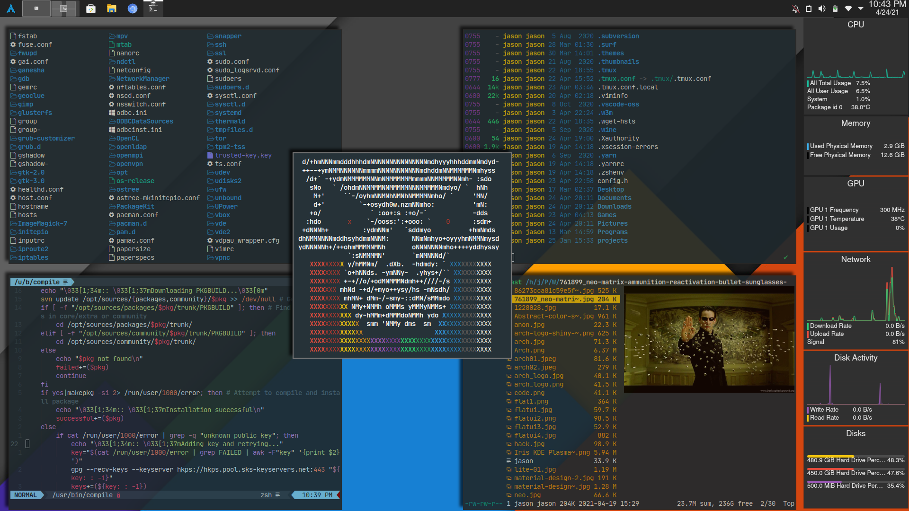

# **Suckless Simple-Terminal**

## **Patches applied:**
  - *anysize*
  - *scrollback*
  - *scrollback-mouse*
  - *scrollback-mouse-altscreen*
  - *desktopentry*
  - *xclearwin*
  - *w3m*
  - *font2*
  - *sync* (part 2)
___
## **Other changes**
- Colors:  
    Default: [FlatUI colors](http://designmodo.github.io/Flat-UI/)
    Alternative: Standard colors are [OneDark](https://github.com/joshdick/onedark.vim) except for the background which is considerably darker. Bright colors are a pastel version of OneDark.  
    To switch colorschemes: `mv config.h.alt config.h`

- Font: Uses JetBrainsMono Nerd Font as primary (can be changed). Uses MesloLGS NF as a secondary (I suggest leaving this one as is and downloading below because this font will provide icons if the primary font does not.)  
|[MesloLGS NF Regular.ttf](https://github.com/romkatv/powerlevel10k-media/raw/master/MesloLGS%20NF%20Regular.ttf)|
|[MesloLGS NF Bold.ttf](https://github.com/romkatv/powerlevel10k-media/raw/master/MesloLGS%20NF%20Bold.ttf)|
|[MesloLGS NF Italic.ttf](https://github.com/romkatv/powerlevel10k-media/raw/master/MesloLGS%20NF%20Italic.ttf)|
|[MesloLGS NF Bold Italic.ttf](https://github.com/romkatv/powerlevel10k-media/raw/master/MesloLGS%20NF%20Bold%20Italic.ttf)|
___
## **Install**
- *edit config.mk to match your setup*
- `make clean install`
___
**FlatUI:**

**OneDarkMod:**

Note: ST looks for cflags in your environment variables. If you have them set you will get an optimized build.
